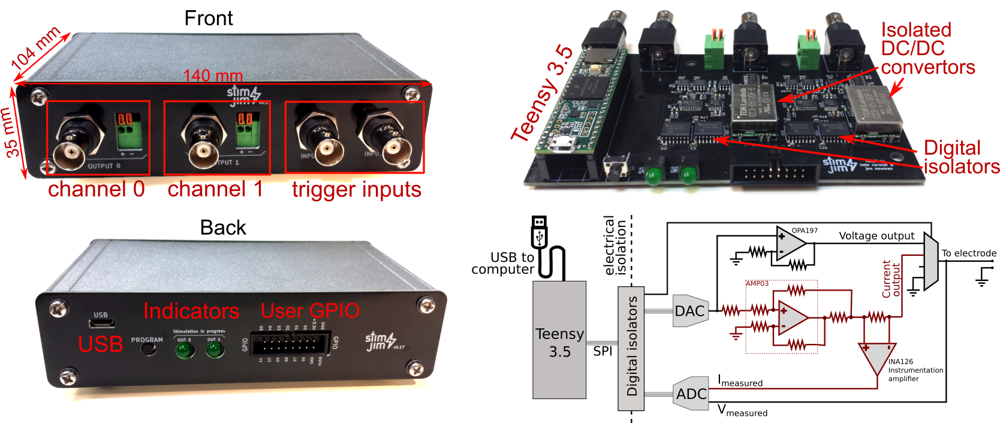
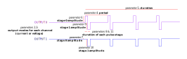

Stimjim - a flexible, precise, and inexpensive open-source stimulator
-------------------------------
Stimjim is a current and voltage stimulator for stimulating neural tissue (as with stimulating electrodes). 

# Specifications:

 - Two independently-controllable output channels, each with both current and voltage output modes
 - Total cost: $200 USD.
 - Output range in current mode: -3.33mA to +3.33mA. 
 - Output range in voltage mode: -15V to 15V.
 - Pulse width down to 0.02 ms (as configured with default firmware)
 - Compliance voltage is +-13.7V in current mode (+/-3.33uA output possible for resistances up to 4k, +-137uA possible for resistances up to 100k)
 - Powered by USB
 - Channels are isolated from power supply and from each other.
 - Onboard ADC measurement of actual output current or voltage
 
# Building your own Stimjim:

Here are the steps to build your very own Stimjim box. 

### Option 1: Assemble (solder components onto) the board yourself.

1. Order printed circuit boards (PCBs) for the [main board](./PCB/stimjimFabricationFiles_v0.181.zip) (4-layer, 129x79.5 mm, otherwise standard order parameters) and the [enclosure front and back panels](./PCB/stimjimPanelFabricationFiles_v0.18.zip) (1-layer, 2 designs, total size 140x71 mm) from [JLCPCB](https://jlcpcb.com/), [Seeedstudio](https://www.seeedstudio.com/fusion_pcb.html) or any other PCB manufacturer. Note that for the panels, the PCB manufacturer may alert you to the fact that there is no exposed copper. This is correct, there should be a copper layer entirely covered by soldermask.
2. Order [components](./stimjim_BOM.xlsx) (entirely from [Digikey](https://www.digikey.com/)).
3. Solder components onto the PCB, using the [schematic](./schematic.pdf) and [layout](./pcb.pdf) files for reference. This may take a few hours, depending on your soldering experience and capability. I typically use a pair of good tweezers, leaded solder paste, and a soldering iron, although a reflow oven also will work as well and may be easier.

### Option 2: Use [SeeedStudio's assembly service](https://www.seeedstudio.com/fusion_pcb.html). 
Recent estimate is about $800 for two assembled boards, plus another roughly $100 for the enclosure and panels. Thanks to Vincent Prevosto for trying this out and submitting these instructions!

1.  The main board PCB and components can be ordered and assembled together on SeeedStudio.
    To order assembled boards, go to [https://www.seeedstudio.com/fusion_pcb.html](https://www.seeedstudio.com/fusion_pcb.html).
   
    *   Click on **Add Gerber Files** and upload [the main board Gerber files](./PCB/stimjimFabricationFiles_v0.181.zip). 
        Make sure to select 4 layers and enter correct dimensions (129x79.5 mm). 
        Select PCB quantity (minimum 5).
    *   Move now to the **PCB Assembly** section.
    *   Click on **Add Assembly Drawing & Pick and Place File** and upload the [zip file containing pdf assembly files and position files](./PCB/stimjim_SeeedStudioAssembly_PickAndPlace.zip).
    *   Select the requested PCB assembly quantity (tested with 2 for $780 USD in late 2019).
    *   Click on **Add BOM File** and upload the [Seeedstudio-formatted Bill of Materials](./PCB/stimjim_SeeedStudioAssembly_BOM.xlsx). The service will check parts availability. Seeedstudio may not be able to provide an instant quote, but they should send you one within a day.
    *   Seeedstudio-assembled Stimjims have been successfully tested by one user, but you have the option to have SeeedStudio test the assembly as well.
   
2. Order the [front and back panels for the enclosure](./PCB/stimjimPanelFabricationFiles_v0.18.zip) (1-layer, 2 designs, total size 140x71 mm) from [Seeedstudio](https://www.seeedstudio.com/fusion_pcb.html), [JLCPCB](https://jlcpcb.com/) or any other PCB company you like.
3. Order the enclosure itself (see the line "enclosure" in the [Bill of materials](./stimjim_BOM.xlsx)) from [Digikey](https://www.digikey.com/).

### Continuing from either option 1 or 2:

4.  Put the main board inside the enclosure (bottom slot), and screw the panels onto the front and back of the enclosure. 
5.  Connect the Stimjim to the computer via USB. Compile and download the [firmware](./stimjimPulser/) onto the Teensy, using the [Arduino IDE](https://www.arduino.cc/en/main/software) with [Teensyduino](https://www.pjrc.com/teensy/td_download.html) installed (or write your own!). Before compiling stimjimPulser.ino, You will need to install the Stimjim library by copying the [stimjim library folder](./lib/) to the appropriate arduino "libraries" folder on your computer. On Windows, this is typically My Documents/Arduino/libraries and on linux it is typically ~/Arduino/libraries. 
6.  Upon bootup, Stimjim should self-report (via the serial connection, visible using the "Serial Monitor" tool in the Arduino IDE) on a handful of calibration routines it runs. Example output looks as follows:

	    Booting StimJim on Teensy 3.5!
	    Initializing inputs...
	    ADC offsets (+-2.5V): -11.030000, -11.150000
	    ADC offsets (+-10V): -10.220000, -10.340000
	    current offsets: 11, 8
	    voltage offsets: 0, 0
	    Ready to go!
	   
	The ADC offsets indicate the ADC reading (in ADC units, 2.4mV per ADC unit) from the output when the output is grounded, for channels 0 and 1, respectively. The ADC typically has a small but nonzero "Zero offset error" which is the reading when it should be reading exactly 0V. Stimjim measures this error (with two different range settings) and corrects all subsequent readings. We typically see values less than 20 - a value of +-4096 indicates some sort of problem with the board.
	
	Current offsets are the raw value of the DAC output (-32768 to 32767) that yields the current reading closest to 0uA. This offset is also used in subsequent stimulation to avoid any small but consistent DC current during pulses.

# Getting started using Stimjim:

To generate a pulse train, you first need to send a serial command, terminated by a newline (\n) in order to define a PulseTrain. An example command would be:

    S0,0,1,2000,1000000; 100,0,150; -100,-100,200
   
The "S" is to *s*pecify the parameters of a pulse train, and the zero immediately following the S implies that we are going to set parameters for PulseTrain 0. The code provided here allows Stimjim to store 100 different PulseTrain parameter sets. If any comma- and semicolon-separated numbers appear following the S, they are the pulse train parameters. A command that simply consists of "S0" will result in simply printing out the current parameters of PulseTrain 0. 

Once a PulseTrain is defined, to run it you would send a command of the form:

    T0

This tells Stimjim to start running PulseTrain 0. If we had parameterized PulseTrain #3, we could just as easily run PulseTrain #3 with the command "T3".

##  Parameterization 

The numbers that come after an "S" indicate parameters as denoted below:

1. [PulseTrain number], 
2. [output 0 mode],
3. [output 1 mode],
4. [period],
5. [duration];
6. [mV or uA for stage 0 output 0],
7. [mV or uA for stage 0 output 1],
8. [stage 0 duration (us)]; 
9. [mV or uA for stage 1 output 0],
10. [mV or uA for stage 1 output 1],
11. [stage 1 duration (us)];
12. (etc for additional stages, up to 10 total stages).

After the "S", the first parameter is the number of the PulseTrain that we are defining. The next two parameters are the modes of each output channels. Modes are as follows:

 - 0 = Voltage output
 - 1 = Current output
 - 2 = Output is disconnected
 - 3 = Output is grounded

Our example command above was: 
   
    S0,0,1,2000,1000000; 100,0,150; -100,-100,200
   
In this example, output 0 is generating a voltage output (mode 0), and output 1 is generating a current output (mode 1). To specify that a channel should not output anything during a pulse train, set the mode to 3 (ground).  

The fourth parameter is the _period_ of the pulse train. In this example, pulses are delivered every 2000 us (2 ms).

The fifth parameter is the _duration_ of the pulse train, in microseconds. In the example, the pulse train lasts for one second (1000000 microseconds).

Parameters after the 5th come in sets of 3, and describe a "stage" of a pulse in the train.  The first two parameters are the amplitude (in mV or uA, depending on whether the output is voltage or current) of each channel during that stage, and the third is the duration (in microseconds) of that stage. Note that a semi-colon is before the beginning of each set of 3, and the three parameters themselves are separated from each other by commas.

In the example given above, there are two stages to each pulse. In the first, channel 0 outputs 100mV, channel 1 outputs nothing, and that lasts for 150 usec. Then channel 0 switches to outputting -100mV, and channel 2 outputs -100uA for 200 usec. 

## Triggering
Stimjim can utilize trigger signals from its BNC inputs. To make a rising edge on input 0 trigger PulseTrain 1, send the command

	R0,1

To make a rising edge on input 1 trigger PulseTrain 2

	R1,2
	
And finally, to make a falling edge on input 1 trigger PulseTrain 2:

	R1,2,1

The final argument for the R command is optional, and defaults to 0 (rising edge).

