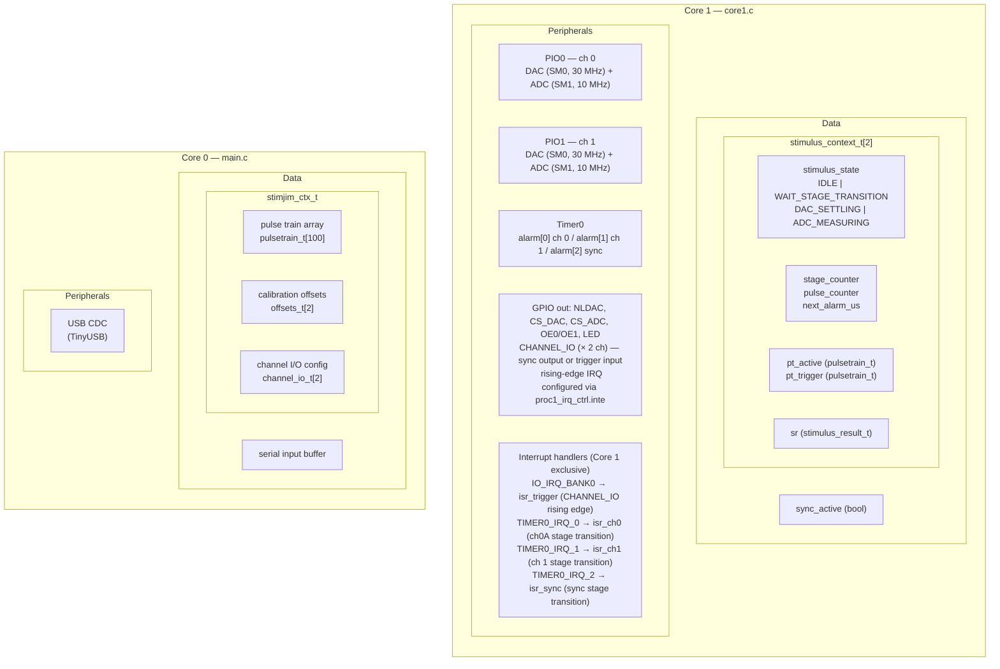
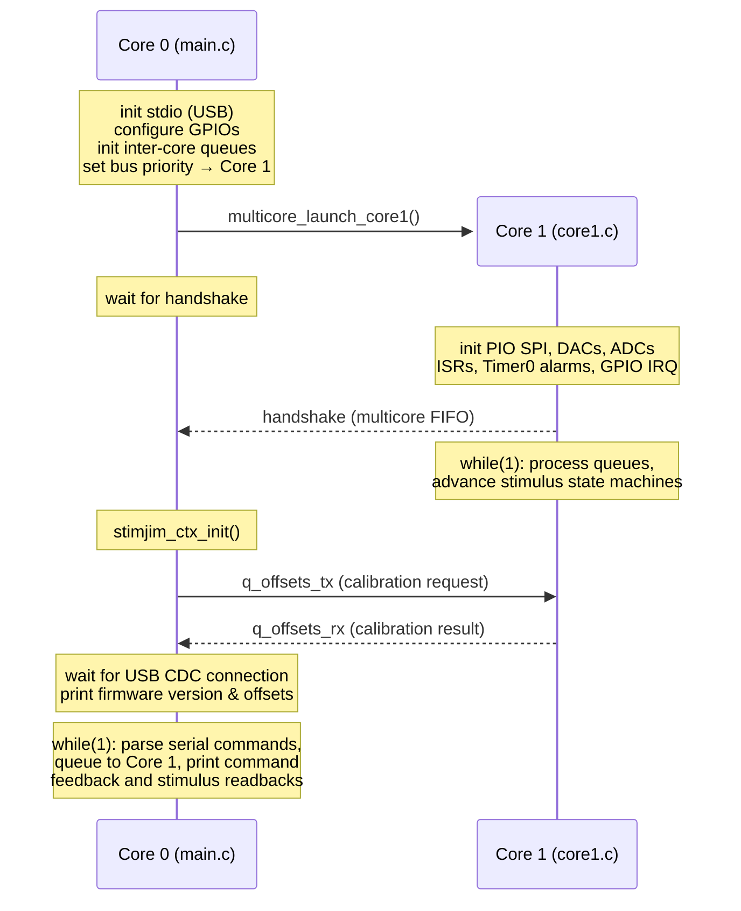
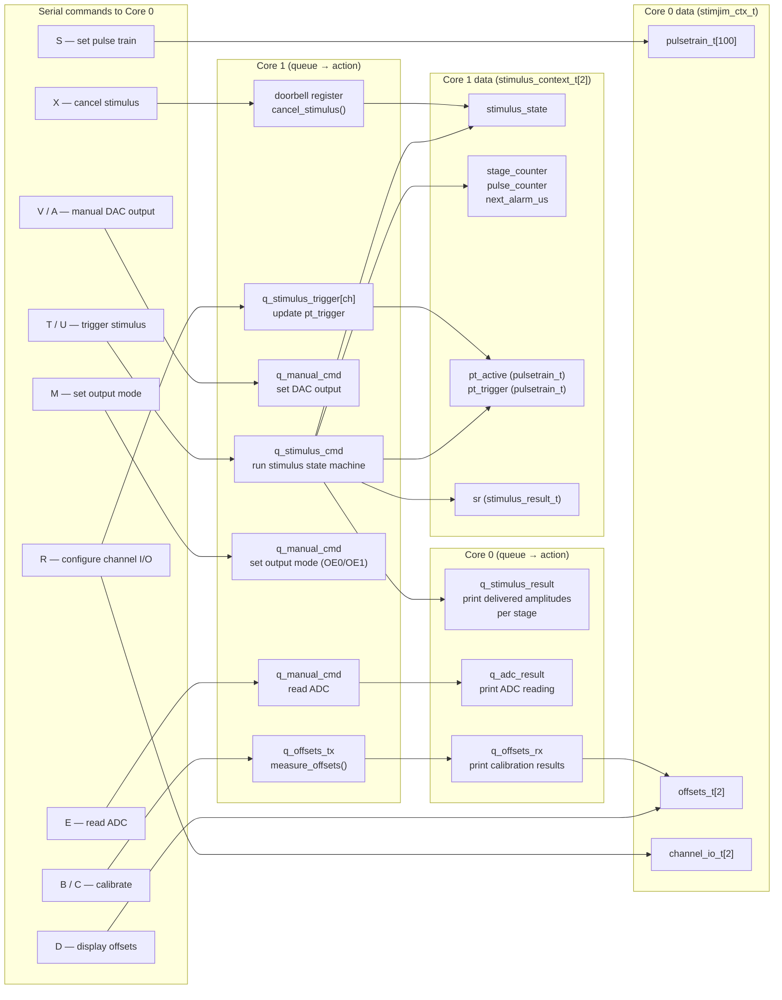
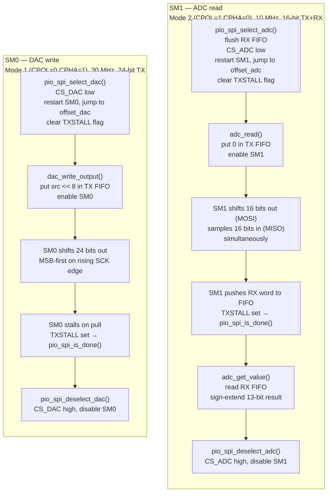
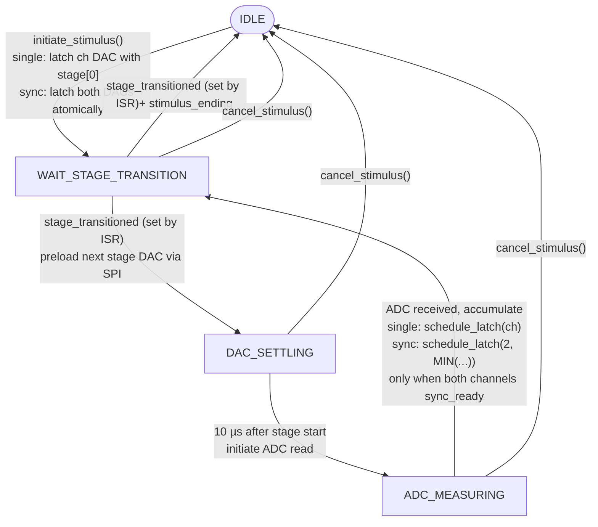
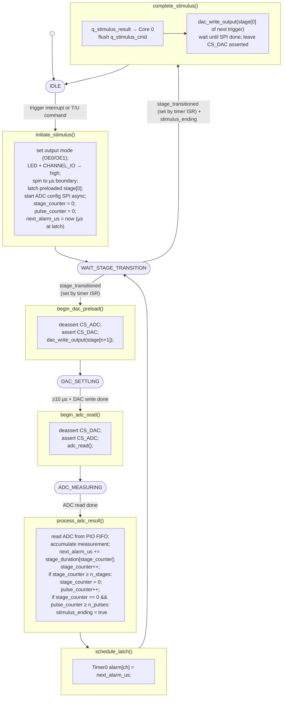

# StimJim Firmware Architecture

## Design decisions

This table describes some decisions made about the stimjim firmware architecture.

|  |  |  |
|---|---|---|
| Dual-core | Core 0 = USB/UI, Core 1 = stimulus timing | Isolates real-time work from blocking USB I/O |
| Inter-core queues & doorbell | Most cross-core communication goes through queues; cancellation uses the doorbell | Core 0 can never corrupt Core 1 timing-critical state |
| PIO-based SPI | Two state machines per SPI bus | Non-blocking 30 MHz DAC writes and 10 MHz ADC reads, allows asynchronous stimuli delivery |
| Timer alarms | alarm[0] ch0, alarm[1] ch1, alarm[2] sync | Allows fully independent or synchronized dual-channel stimulus |
| Pin interrupt | rising edge on either channel input incurs ISR | Allows low latency between trigger and start of stimulus delivery |

## Data & peripheral ownership

> [!NOTE] 
> GPIO and hardware listed under Core 1 is exclusively managed by Core 1 during
> normal operation. However, Core 0 also initializes and configures some of
> these GPIO pins before Core 1 is launched. Additionally, Core 0 writes
> `io_bank0_hw->proc1_irq_ctrl.inte` at runtime (via the R command) to enable or
> disable the rising-edge interrupt on CHANNEL_IO pins; Core 1 processes these
> interrupts via `isr_trigger`.



## Startup sequence

This chart is supposed to show how core 0 and core 1 interact during startup.



## Command flow

This chart is supposed to show the flow of data whenever a user sends a command.
Some data gets passed back and forth between cores through thread-safe queues
before being saved and printed.



## PIO assembly

This section explains some of the PIO stuff.

PIO communicates with the ARM cores through TX/RX FIFOs, and uses two shift
registers internally: the **OSR** (Output Shift Register) shifts bits out onto
MOSI one at a time; the **ISR** (Input Shift Register) accumulates incoming bits
from MISO.

### PIO instruction reference

| Instruction | What it does |
|---|---|
| `pull block` | Wait until ARM puts a word in TX FIFO, then load it into OSR |
| `out pins, 1` | Shift 1 bit from OSR onto MOSI |
| `in pins, 1` | Sample 1 bit from MISO into ISR |
| `push block` | Send ISR contents to RX FIFO for ARM to read |
| `set x, N` | Set counter register x to N |
| `jmp x-- label` | Decrement x and jump to label if x was non-zero; fall through if x was 0. Used as a loop counter: `set x, N` then `jmp x-- loop` runs the loop body N+1 times |
| `label:` | A named anchor — not an instruction, just a target for `jmp` |
| `side N` | Simultaneously set SCK to N while executing this instruction — no extra cycle cost. The pin is wired to SCK at init time via `sm_config_set_sideset_pins(&c, sck)` |
| `.wrap / .wrap_target` | When execution reaches `.wrap`, loop back to `.wrap_target` automatically |

### Mode 1 — DAC write (SM0), 30 MHz SCK

CPOL=0, CPHA=1: SCK idles **low**. The master drives MOSI on the rising edge;
the DAC latches it on the falling edge. The ARM sends a 32-bit word left-aligned
with the 16-bit DAC code in the top 16 bits; the PIO shifts out the top 24 bits
(16-bit code + 8 zero command bits).

```asm
.program pio_spi_mode1
.side_set 1                       ; one side-set pin = SCK, idles low (0)

.wrap_target
    pull  block       side 0      ; wait for ARM to write a word; load it into OSR; hold SCK low
    set   x, 23       side 0      ; set loop counter to 23 (will count 24 iterations: 23 down to 0)
bitloop_m1:
    out   pins, 1     side 1      ; shift MSB of OSR onto MOSI; simultaneously raise SCK
    jmp   x-- bitloop_m1  side 0  ; lower SCK; decrement x and loop (exits when x was 0)
.wrap                             ; go back to pull — SM stalls here waiting for next word
                                  ; the stall sets the TXSTALL flag, used to detect completion
```

### Mode 2 — ADC read (SM1), 10 MHz SCK

CPOL=1, CPHA=0: SCK idles **high**. The ADC drives MISO just before the falling edge; the master samples it on the falling edge, then drives the next MOSI bit on the rising edge. The PIO sends a dummy 16-bit word to generate SCK cycles while simultaneously capturing 16 bits from MISO. One bit of MOSI is driven before the loop to keep the bit counts balanced at 16 each.

```asm
.program pio_spi_mode2
.side_set 1                       ; one side-set pin = SCK, idles high (1)

.wrap_target
    pull  block       side 1      ; wait for ARM word; load into OSR; hold SCK high
    set   x, 14       side 1      ; loop counter: 14 (15 iterations), plus 1 bit before + 1 after = 16 total
    out   pins, 1     side 1      ; drive MOSI[15] before the first falling edge

bitloop_m2:
    in    pins, 1     side 0      ; lower SCK (falling edge): sample MISO into ISR
    out   pins, 1     side 1      ; raise SCK (rising edge): drive next MOSI bit
    jmp   x-- bitloop_m2  side 1  ; loop (side 1 holds SCK high between iterations)

    in    pins, 1     side 0      ; final falling edge: sample last MISO bit
    push  block       side 1      ; send 16-bit ISR to RX FIFO; return SCK to idle high
.wrap                             ; go back to pull
```

Total: 16 MISO samples, 16 MOSI bits. The received word is sign-extended by `adc_get_value()` to recover the 13-bit ADC result.

## PIO SPI state machine

SM0 and SM1 share the same SCK and MOSI pins and can never run simultaneously. `pio_spi_select_*` stops the SM, resets it, and jumps to the correct program entry before asserting CS.



## Stimulus state machine

This state machine runs per channel (`stimulus_context_t[2]`), driven by
`advance_stimulus()` in Core 1's `while(1)` loop. When both channels are
supposed to operate synchronously, the 



**ISR role:** `isr_ch0/1` (single) or `isr_sync` (sync) fires at the Timer0
alarm — latches the DAC value preloaded after a stage transition (single: one
NLDAC pulse; sync: both NLDACs on the same clock cycle), then sets
`stage_transitioned`. `stimulus_ending` causes the ISR to drive output to GND
instead of latching.

### PIO SPI state during stimulus delivery

| Stimulus state | Active PIO SM | What the SPI is doing |
|---|---|---|
| IDLE | none | idle; DAC SM stalled with trigger pulse train's first stage preloaded |
| WAIT_STAGE_TRANSITION (waiting for ISR) | none | idle, waiting for Timer0 alarm to fire |
| WAIT_STAGE_TRANSITION (ISR fired, stage_transitioned=true) | SM0 (DAC) | transmitting next stage amplitude to DAC |
| DAC_SETTLING | SM0 stalled | transmission complete; waiting 10 µs for analog output to stabilize |
| ADC_MEASURING | SM1 (ADC) | clocking out dummy bits to generate SCK, sampling MISO |

## Stimulus lifecycle pt2



**Timer0 ISR role:** `isr_ch0/1` (single) or `isr_sync` (sync) fires when
`alarm[ch]` expires — clears `intf[ch]`, re-arms `intr[ch]`, then sets
`stage_transitioned`. If `stimulus_ending` is true, it drives `OE0/OE1 → GND`
and clears LED + CHANNEL_IO instead of pulsing NLDAC.
