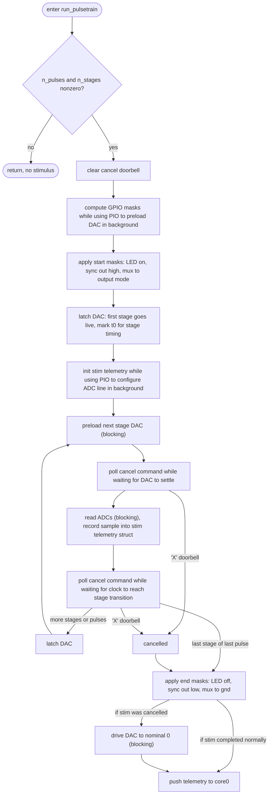

Design notes:

Cores:
- Core0: Handles USB/serial communication, command parsing, stimjim_context
  struct. Hands work to core1 over queues and reports results from core1 back
  over queues; never touches GPIO after initialization or real-time hardware.
- Core1: all real-time work: pulse-train delivery, trigger handling, every
  ADC/DAC interaction, and every GPIO interaction after core1 initialization.

Core1 main loop:
- No interrupts
- Handles commands from core0 
  - Commands transmitted over queue q_core1_cmd: stimulus request (T/U),
    trigger/pulsetrain config (R/S), offset calibration (B/C/D), and manual
    DAC/ADC/output-mode (A/M/V/E) over queue.
  - Commands transmitted over doorbell: cancellation (X).
- Each iteration of the while(1) loops polls the command queue. if there is a
  stimuls requested by the user. If there is not stimulus requested by the user,
  it polls the triggers. a pulse train is delivered. After a pulse train is
  delivered, the rest of the command queue, ignoring any stimulus commands that
  might've arrived during stimulus delivery.
- Trigger edges are cleared after stimulus delivery, so rising edges that arrive
  during a stimulus delivery are discarded.
- Cancel ('X') command is raised by core0 on the inter-core doorbell and polled
  while waiting for the stage to terminate (except for a brief period during the
  ADC read).

Triggers (polled, no ISR):
- Upon receiving an R command, core0 arms a CHANNEL_IO pin as a trigger by
  setting its rising-edge enable bit (proc1_irq_ctrl.inte); the NVIC IRQ is
  never enabled so there is no ISR. 

How are triggers/ commands that arrive during stimulus delivery handled?
- Commands arriving during delivery are immediately handled after stimulus
  delivery: all are applied (R/S, B/C/D, E, A/V, M) except extra stimulus
  requests (T/U), which are discarded.
- Trigger edges are cleared only by a delivery (in run_pulsetrain), so edges
  latched during stimulus delivery are ignored, but otherwise a trigger arriving
  during command handling is honored on the next pass.

Timing:
- Stage timing uses the core1 DWT cycle counter (clk_sys, 150 MHz).
- DAC/ADC SPI runs on PIO (two state machines per PIO: DAC @ 30 MHz,
  ADC @ 10 MHz).

Jitter avoidance (the stage-0 pulse width must be exact):
- The entire core1 hot path is SRAM-resident (.time_critical / __always_inline)
  so it is immune to XIP flash-cache misses, which can stall the core for
  several µs.

Core1 stimulus state machine (run_pulsetrain / pulsetrain_loop):

In the above diagram, GPIO masks refer to precomputed atomic set/clear bit
patterns applied to set LED, SYNC signal, and analog multiplexer.
- LED: channel activity indicator, on for the duration of the stimulus for a
  respective channel.
- Sync out (CHANNEL_IO): high during the stimulus as a trigger/marker output.
- Analog mux (OE0/OE1): the two output-enable lines that select the channel's
  output mode - voltage, current, float, or ground. Active channels are switched
  to their requested mode at start and back to ground at end.

Command/trigger handling per core1 state:

The main loop polls two sources — the command queue (handle_cmd_queue) and the
trigger inputs (check_pending_trigger_ch) — and delivers a stimulus from either.
What each input does depends on whether a stimulus is already being delivered:

| Input | Idle | During a stimulus |
|---|---|---|
| **T/U** stimulus request | first queued runs; any extra queued T/U is discarded | discarded |
| **R/S** trigger config | applied | queued, applied after delivery |
| **B/C/D** offset calibration | applied (runs calibration) | queued, applied after delivery |
| **A/M/V/E** manual (DAC set / ADC read / output mode) | applied | queued, applied after delivery|
| **trigger edge** (armed CHANNEL_IO input) | delivers that channel's pre-armed pulse train | ignored (edge latch cleared after delivery) |
| **X** cancel (inter-core doorbell) | no effect (nothing to cancel) | polled live; aborts the stimulus |

Input validation (cmd_S, pulse train config):
- Inactive channels (output mode not VOLTAGE/CURRENT, i.e. FLOAT or GND) are
  constrained to amplitude 0 on every stage: cmd_S sets that channel's amplitude
  limit to 0, so the amplitude parses in range [0, 0] and any nonzero value is
  rejected.
- Summed stage durations must not exceed the period.
- Total duration must span at least one period (n_pulses > 0), else rejected.

Changes from stimjim_teensy:
- 'X' cancels active stimulus
- Input validation
- Removed 2.5V calibration (2.5V and 10V offsets differ)

Suggested changes:
- Period = sum of stage durations
- Specify n_pulses not total duration
- B should auto-run C (voltage/current offsets depend on ADC offsets)?